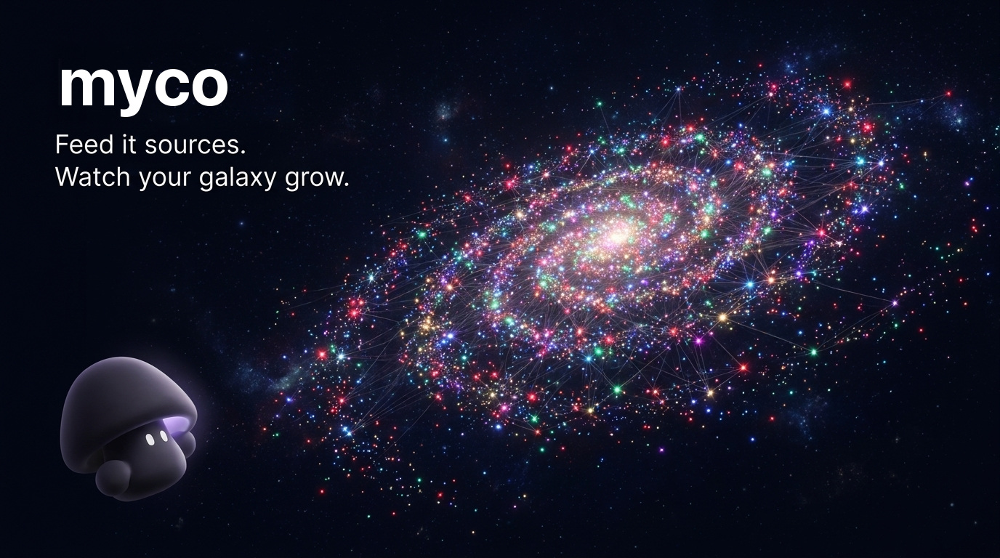
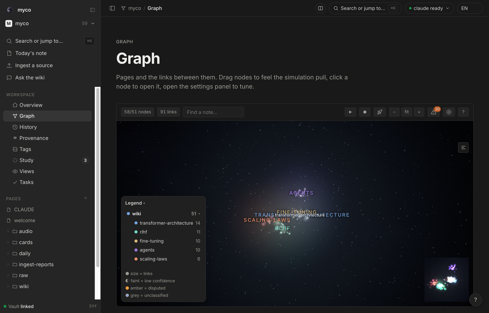
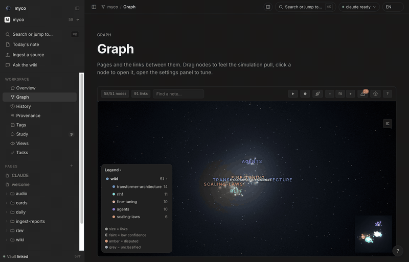
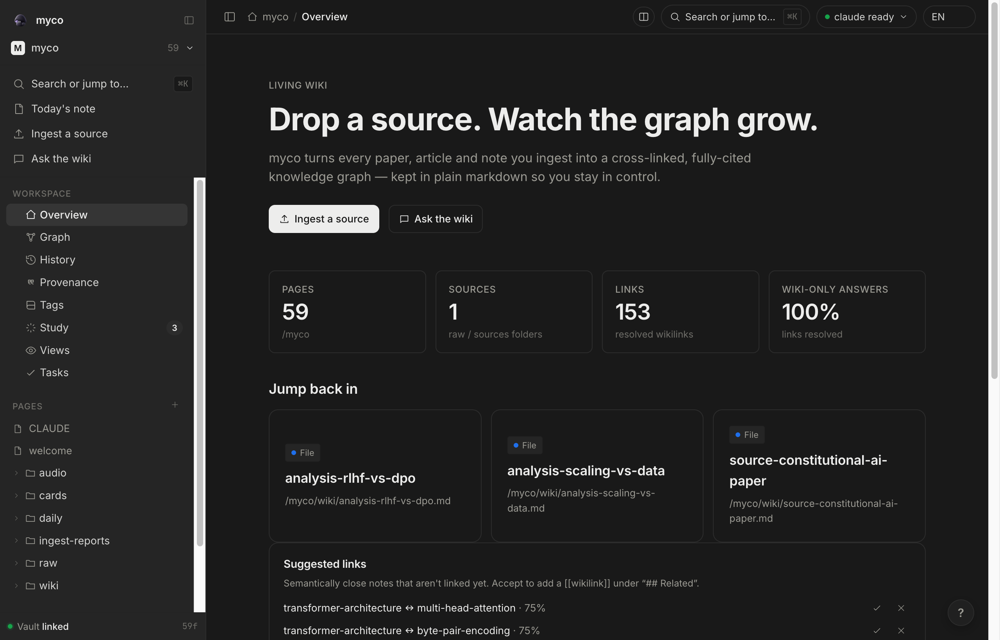
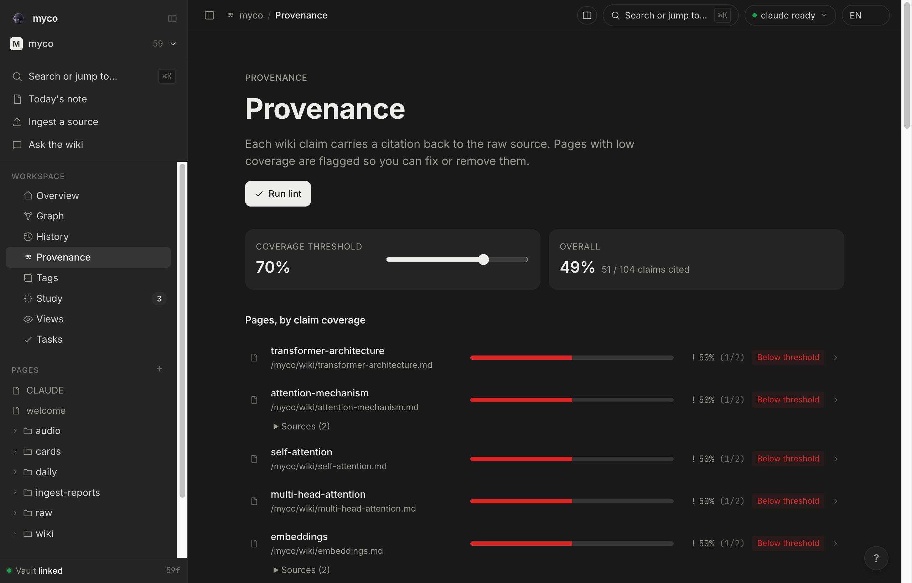
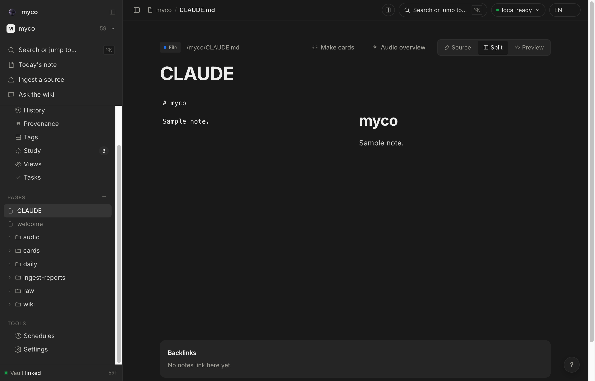
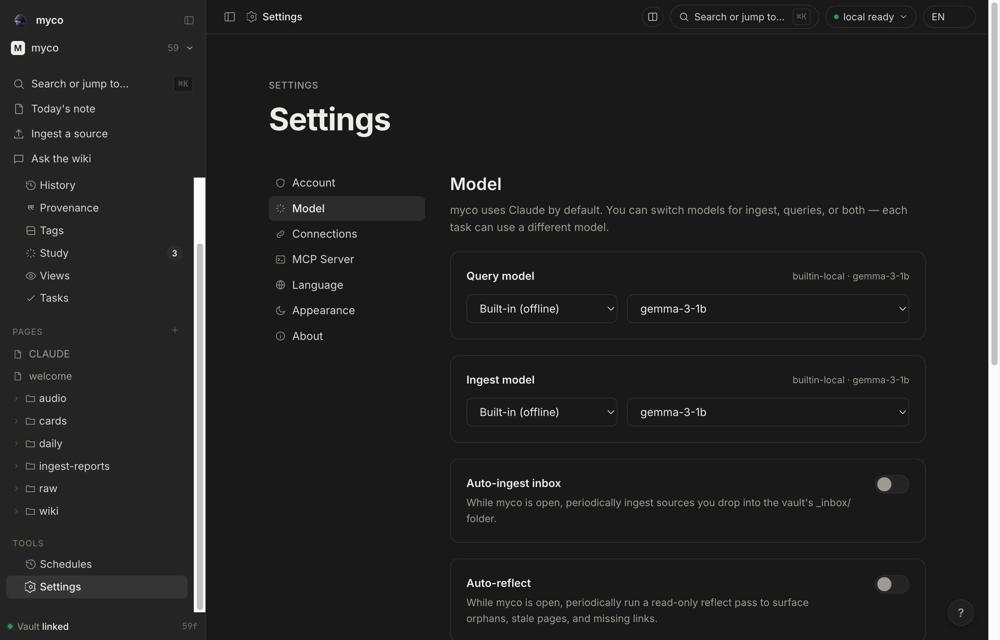

<div align="center">

<br />



<h1>myco</h1>

<p><strong>스스로 자라는 개인 지식 베이스.</strong></p>

<p>
소스를 떨어뜨리면, Claude가 정리를 맡습니다.<br/>
지식은 복리로 쌓입니다 — 당신이 소유한 평범한 마크다운으로.
</p>

<p>
<a href="https://github.com/cmblir/Myco/releases/latest"></a>
&nbsp;

&nbsp;

&nbsp;
<a href="README.md"></a>
</p>

<br />

<p>
<em>"Obsidian은 IDE, Claude는 프로그래머, 위키는 코드베이스."</em>
</p>

<br />



<sub><em>Graph 뷰. 모든 노트는 링크 수만큼 커지는 별, 커뮤니티마다 고유한 색, <code>[[위키링크]]</code>가 이들을 잇는 조직입니다.</em></sub>

</div>

---

## 왜?

대부분의 LLM+문서 구성은 **쿼리마다 지식을 다시 유도**합니다. RAG가 청크를 찾고, 모델이 답을 짜맞추고, 아무것도 남지 않습니다. 같은 문서에 열 번 질문하면 → 열 번 재발견합니다.

**myco는 이걸 뒤집습니다.** 소스를 한 번 추가하면 Claude가 읽고, 영속 위키에 통합하고, 기존 페이지와의 모순을 표시하고, 인용을 연결하고, 커밋합니다. 열 번째 질문쯤엔 위키 자체가 답합니다 — 정리는 이미 끝나 있으니까요.

[Andrej Karpathy의 LLM Wiki 패턴](https://gist.github.com/karpathy/442a6bf555914893e9891c11519de94f)에 기반합니다. 뿌리는 [Vannevar Bush의 1945년 Memex](https://en.wikipedia.org/wiki/Memex)까지 거슬러 올라가며, 프로젝트의 원래 이름이기도 했습니다.

```
  raw/              원본 소스. 불변.
    │  Ingest
    ▼
  wiki/             Claude가 유지하는 페이지. 인용 [^src-*], 상호 연결.
    │
    ▼
  myco 데스크톱 + Obsidian(선택) + 셸 / git 클라이언트
  모두 같은 파일을 봅니다. myco는 vault를 잠그지 않습니다.
```

---

## 설치

**[최신 릴리즈](https://github.com/cmblir/Myco/releases/latest)**에서 플랫폼에 맞는 번들을 받으세요:

- **macOS** (Apple Silicon): `myco_x.y.z_aarch64.dmg` — 미서명; 첫 실행 시
  Gatekeeper 경고가 뜹니다 (앱 우클릭 → **열기** → **열기**, 또는
  **시스템 설정 → 개인정보 보호 및 보안 → "그래도 열기"**).
- **Windows x64**: `myco_x.y.z_x64-setup.exe` — 미서명; 첫 실행 시 SmartScreen
  경고가 뜹니다 (**추가 정보 → 실행**).

첫 실행 시 `~/Documents/myco/`를 만들고 유지 규칙(`CLAUDE.md`), `raw/`,
`wiki/`(첫날부터 Graph가 채워져 보이도록 상호 연결된 스타터 노트 — 언제든 삭제
가능), `daily/`, `ingest-reports/`를 시드합니다. 다른 폴더(기존 Obsidian vault
등)를 쓰려면: 설정 → 계정 → 변경…

---

## 스크린샷

<p align="center">

</p>

<table>
<tr>
<td width="50%"></td>
<td width="50%"></td>
</tr>
<tr>
<td align="center"><sub><strong>개요</strong> — 통계, 바로가기, 최근 활동</sub></td>
<td align="center"><sub><strong>출처</strong> — 페이지별 인용 커버리지</sub></td>
</tr>
<tr>
<td width="50%"></td>
<td width="50%"></td>
</tr>
<tr>
<td align="center"><sub><strong>리더</strong> — 소스 / 분할 / 미리보기 + 백링크</sub></td>
<td align="center"><sub><strong>설정</strong> — Query / Ingest 모델 분리</sub></td>
</tr>
</table>

---

## 기능

**Ingest** — 파일을 드롭하거나 텍스트를 붙여넣으면 `raw/`에 저장되고, 활성
모델이 인용·로그·WHY 리포트와 함께 `wiki/`에 통합합니다. 입력은 멀티모달:
PDF, Office 문서, 스프레드시트, 이미지(비전 프로바이더), 오디오/비디오(설치된
`whisper` CLI), YouTube URL. 내장 오프라인 임베딩 인덱스(bge-m3, 인프로세스
llama.cpp)가 시맨틱 검색과 페이지별 관련 노트를 제공합니다.

**Ask & 에이전트 모드** — 연결된 어떤 모델로든 위키와 대화합니다. 에이전트
모드는 툴 지원 프로바이더를 자율 리서처로 바꿉니다: 검색하고, 페이지를 읽고,
링크를 타고, 인용과 함께 답합니다. 쓰기 도구는 호출마다 확인을 받으며 `raw/`는
절대 건드리지 않습니다. 오디오 개요는 답변의 인용 페이지를 두 명의 진행자가
나누는 대화로 오프라인 렌더링합니다.

**Graph** — vault 전체를 3D 우주 거미줄로 (three.js + d3-force-3d). Louvain
커뮤니티별 색상과 자동 명명 클러스터 라벨, 허브만 빛나는 블룸, Obsidian처럼
고아 노트·고스트 링크 표시. 별을 잡아끌면 시뮬레이션이 다시 달아오르고, 이웃
고립·최단 경로·vault가 스스로 만들어지는 타임랩스도 있습니다. 정적 2D 아틀라스,
자라난 균사 매트 등 대체 레이아웃 엔진 포함. ~1만 노드까지 60fps.

**Study** — 어떤 페이지에서든 플래시카드 생성; FSRS 스케줄링이 붙은
평문 마크다운 덱으로 Obsidian spaced-repetition 플러그인과 왕복 호환됩니다.

**Schedules** — 반복 다이제스트: 상시 쿼리, "무엇이 바뀌었나", 신선도 점검,
토픽 추적. 실행마다 인용된 마크다운 노트를 `digests/`에 남깁니다.

**증류(Distillation)** — 유휴 시간에 새로 들어온 raw/세션 인플로우를 위키의
토픽 클러스터에 대조해 채점합니다: 정크는 임베딩 비용 없이 걸러지고, 근접
중복·주제 이탈 항목은 격리 후 폐기되며, 이미 위키에 반영된 raw 소스는 날짜별
아카이브로 이동합니다. 제안은 피드백 페이지에서 검토하고, 강도·게이트
엄격도·실행 일정은 설정에서 조정합니다.

**리더** — CodeMirror 소스 / 라이브 미리보기 / 분할, `[[위키링크]]` 자동완성,
백링크·관련 노트 패널. `raw/` PDF는 인앱 pdf.js 뷰어로 열립니다: 텍스트 선택 →
하이라이트 & 인용이 핀포인트 링크를 만들고, 하이라이트는 사이드카에 저장되어
`raw/`는 불변으로 남습니다.

**프로바이더** — 내장 오프라인 임베딩(키·설치 불필요), Claude Code CLI(Pro/Max
구독), Anthropic / OpenAI / Google AI / OpenRouter API, 로컬 Ollama.
Query와 Ingest 모델 분리 선택, 월 비용 예산. API 키는 OS 키체인에만 저장 —
디스크에 평문으로 남지 않습니다.

**웹 클리퍼** — 브라우저 확장 + 북마클릿(`clipper/`)으로 어떤 페이지나 선택
영역이든 딥링크를 통해 vault 인박스로 보냅니다.

`⌘K` 커맨드 팔레트(파일·라우트·전문+시맨틱 검색), EN / 한국어 / 日本語 UI,
라이트/다크, 320px까지 반응형.

---

## MCP 서버

같은 vault를 Claude Desktop, Claude Code, 어떤 MCP 클라이언트에서든 쓸 수
있습니다.

**가장 쉬운 길 — 앱이 호스팅.** 데스크톱 앱이 MCP 서버를 인프로세스로
실행합니다(Python 불필요). **설정 → MCP** → **Claude Code에 연결**. 서버는 앱이
현재 연 vault를 따라가고, 토큰이 유지되므로 한 번만 연결하면 됩니다.

<details>
<summary><b>독립 Python 서버 (소스 체크아웃 / 비앱 클라이언트)</b></summary>

Python 3.10+ 필요 (런타임은 표준 라이브러리만).

```bash
bash mcp-server/install.sh            # mcp-server/.venv 생성
bash mcp-server/serve.sh              # http://127.0.0.1:22360/sse 서빙
claude mcp add --transport sse myco http://localhost:22360/sse
```

Claude Desktop은 stdio — `claude_desktop_config.json`에 추가:

```json
{
  "mcpServers": {
    "myco": {
      "command": "<repo>/mcp-server/.venv/bin/python",
      "args": ["<repo>/mcp-server/myco_mcp.py"]
    }
  }
}
```

28개 도구: 읽기(`list_pages` `read_page` `search` `folder_tree` …),
쓰기(`add_raw_source` `create_page` `update_page` `git_commit` …), 인박스,
no-LLM 품질 검사(`lint_citations` `trust_report` `contradictions` …),
멀티 프로젝트 거버넌스(`resolve_cross_links` `export_project` `register_vault`
…). 독립 서버는 `projects/<slug>/` 아래 여러 독립 위키를 관리하며, 각각 자체
`wiki/ raw/ CLAUDE.md`를 가집니다.

</details>

---

## 소스에서 빌드

사전 준비: Node 20+, Rust 1.77+, OS별
[Tauri prerequisites](https://tauri.app/start/prerequisites/).
Git LFS로 클론하세요 (내장 임베딩 모델이 LFS에 저장됩니다).

```bash
cd app
npm install
npm run tauri dev       # 핫리로드 개발 창
npm run tauri build     # 릴리즈 번들: src-tauri/target/release/bundle/
```

테스트와 린트:

```bash
cd app && npm run lint && npx tsc -b && npx vitest run
cd app/src-tauri && cargo fmt --check && cargo clippy --all-targets -- -D warnings && cargo test
```

개발 가이드는 [`app/README.md`](app/README.md), 릴리즈/서명 절차는
[`docs/SIGNING.md`](docs/SIGNING.md)를 참조하세요. 이슈와 PR 환영합니다.

---

## Star History

<a href="https://www.star-history.com/?repos=cmblir/Myco&type=date&legend=top-left">
 <picture>
   <source media="(prefers-color-scheme: dark)" srcset="https://api.star-history.com/chart?repos=cmblir/Myco&type=date&theme=dark&legend=top-left" />
   <source media="(prefers-color-scheme: light)" srcset="https://api.star-history.com/chart?repos=cmblir/Myco&type=date&legend=top-left" />
   
 </picture>
</a>

---

## 크레딧

- **패턴**: [Andrej Karpathy](https://github.com/karpathy) — *[LLM Wiki](https://gist.github.com/karpathy/442a6bf555914893e9891c11519de94f)*.
- **선조**: [Vannevar Bush, "As We May Think"](https://en.wikipedia.org/wiki/As_We_May_Think), 1945.
- **제작 도구**: [Claude Code](https://docs.anthropic.com/en/docs/claude-code).

---

<div align="center">
<br/>
<sub>MIT License · <a href="README.md">English README</a> · <a href="app/README.md">Desktop app docs</a></sub>
</div>
